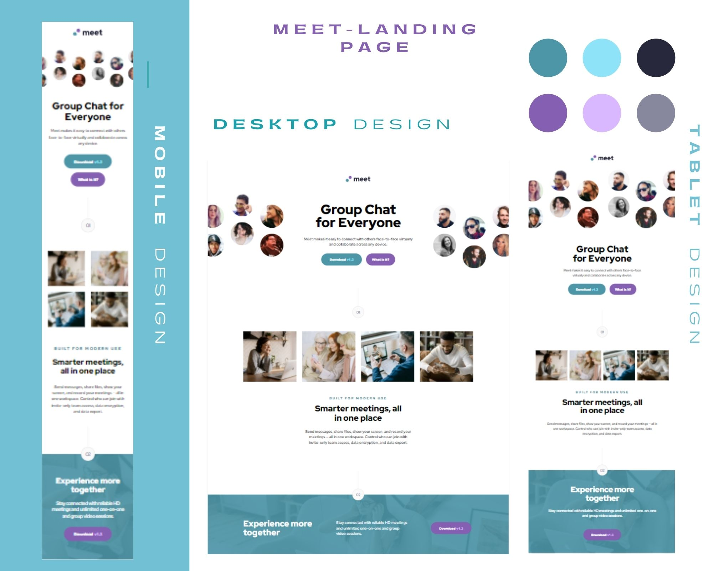
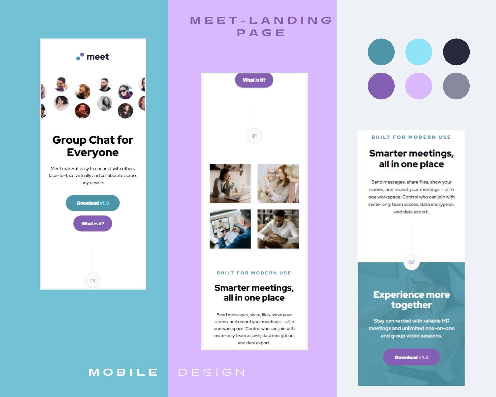
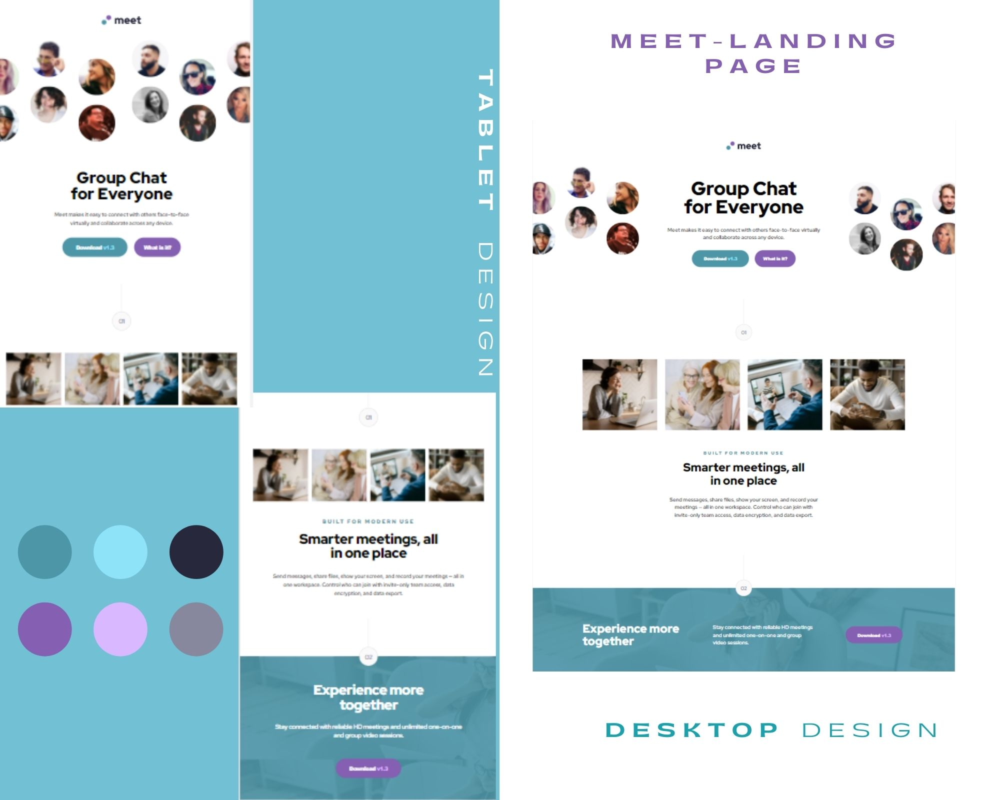
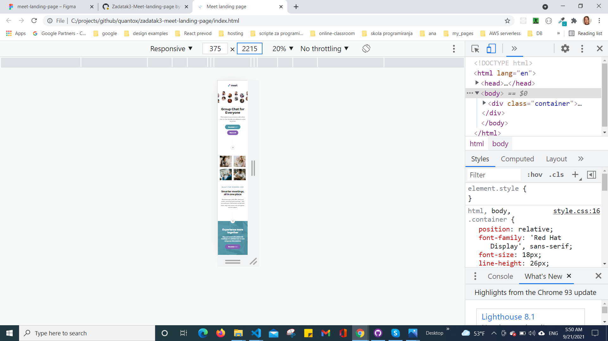
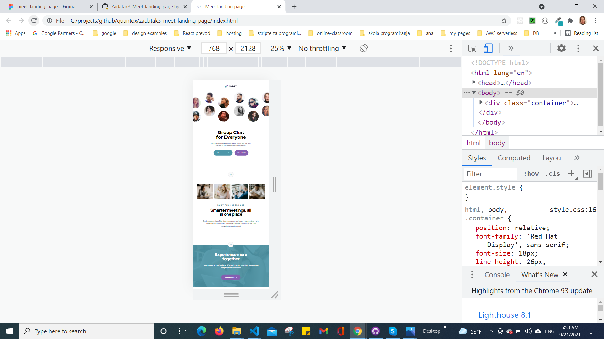
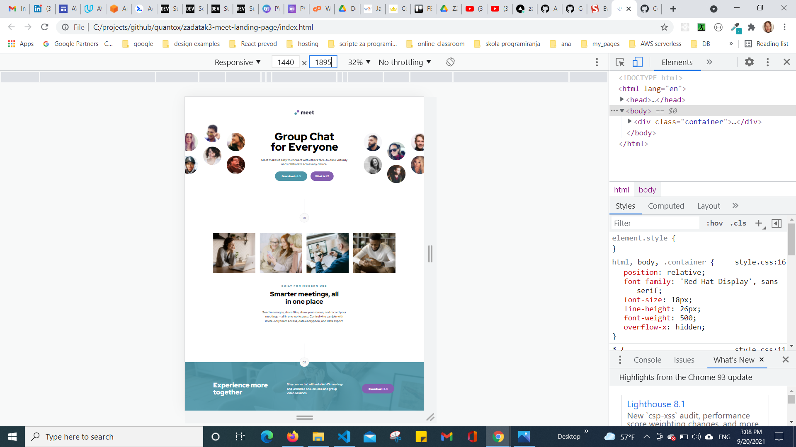
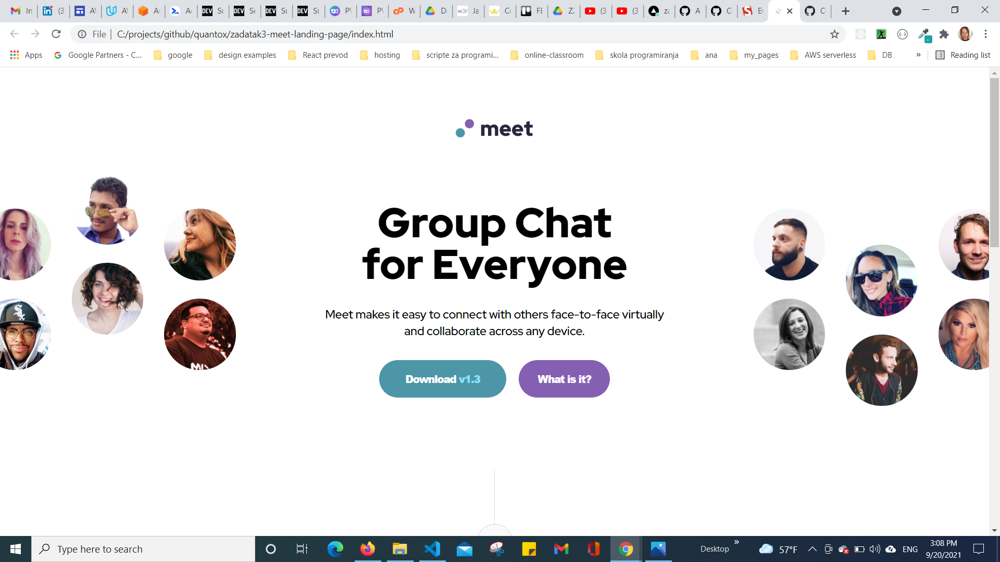
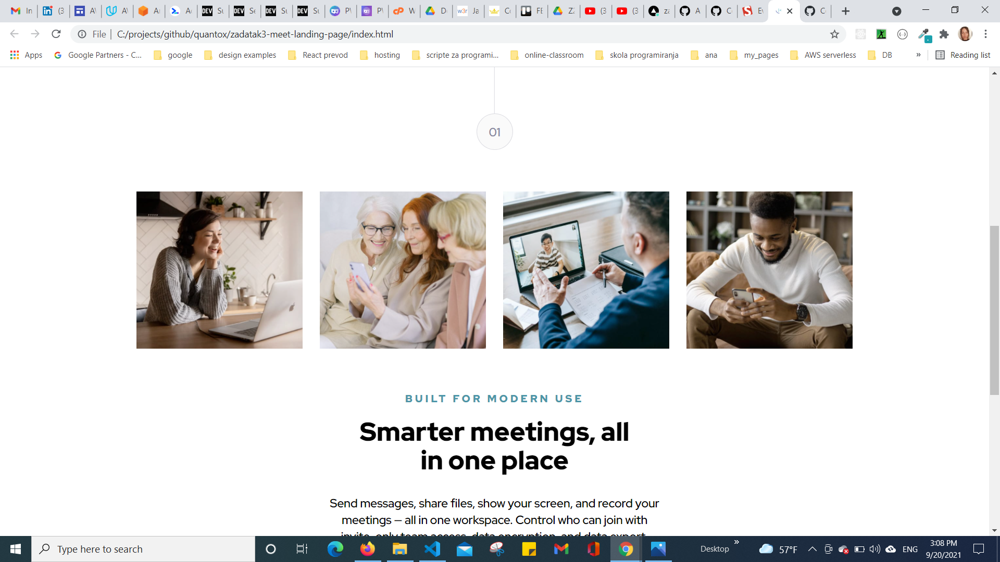
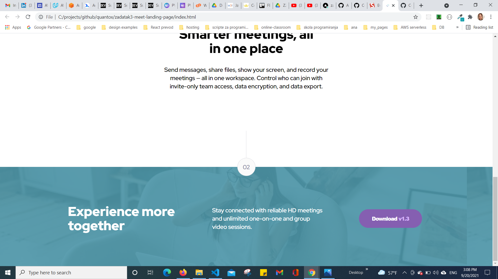

# Meet landing page solution

## Table of contents

  - [Overview](#overview)
  - [The challenge](#the-challenge)
  - [Screenshot](#screenshot)
  - [Links](#links)
  - [My process](#my-process)
  - [Built with](#built-with)
  - [Author](#author)
## Overview

### The challenge

Users should be able to:

- View the optimal layout depending on their device's screen size
- See hover states for interactive elements

### Screenshot

### Links

-  [Solution URL:](https://github.com/tatjama/zadatak3-meet-landing-page/tree/develop)
-  [Live Site URL:](https://zadatak3-meet-landing-page.vercel.app/)
-  [Preview:](https://zadatak3-meet-landing-page-7pf8ntc7m-tatjana.vercel.app/)

## My process

1. Create a new project and
2. Import starting code
3. Initializing git repositories main and development
4. Import git repositories to the Vercel project
5. Create HTML structure
6. Import Avatars and Font styles
7. Use Figma design tools for measurements
8. Create CSS Utility
9. Style for Header Section
10. Style for Main Section
11. Style for Footer Section
12. Responsive breakpoints at 1200px and 700px
13. Compare original designs with my work
14. Create screenshots
15. Change README-template.md to README.md
16. Open Pull request
17. Solve Issue
18. Merge develop branch into master branch
### Built with

- Semantic HTML5 markup
- CSS custom properties
- FlexBox
- Media queries
- Centering elements, content and text
- Background Image
- Element positioning
- Customize font,width and size
- Transparency
- Hover
## Author

- Website - [Tatjana Markovic](https://my-react-portfolio-tatjana.vercel.app/)
- LinkedIn - [Tatjana Marković](https://www.linkedin.com/in/tatjana-markovi%C4%87-919501189/)
- GitHub - [tatjama](https://github.com/tatjama)